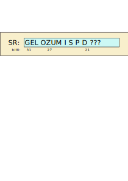

<div>
<lead>
Tässä osiossa käymme läpi esimerkkitietokoneena käytettävän opetuskäyttöön suunnitellun tietokoneen ttk-91 perusrakenne ja sen ohjelmoinnin symbolisella konekielellä. Esittelemme myös ttk-91 emulaattorin Titokone ja ttk-91 symbolisen konekielen ohjelmoinnin harjoitteluympäristön TitoTrainer. 
</lead>
</div>


## Ttk-91
Yleiskuva ttk-91 arkkitehtuurissa annettiin Tietokoneen toiminnan perusteet MOOC'in luvussa 2. Jos nämä tiedot eivät ole ihan tuoreessa muistissa, voit haluta lukea luvun 2 uudelleen nyt. Näitä tietoja kerrataan (vähän) ja täsmennetään nyt tässä.

## Rekisterit
Ttk-91 suorittimella on 8 konekäskyissä viitattavaa rekisteriä. Ne on nimetty R0-R7, mutta rekisterillä R6 on myös nimi SP (stack pointer) ja rekisterilla R7 nimi FP (frame pointer). Näitä kahta rekisteriä käytetään aliohjelmien toteutuksessa, mikä on seuraavan luvun (Luku 6) aihepiiri. Rekisterit R0-R5 ovat ns. työrekistereitä - niihin voidaan tallettaa kaikkien operaatioiden tulos ja ne voivat sisältää aritmeettis-loogisten operaatioiden ensimmäisen operandin. 

Rekistereitä R1-R5 voi käyttää myös indeksirekisterinä jälkimmäisen operandin arvon määrittämisessä. Jos jälkimmäisen operandin arvon määrittämisessä ei tarvitse (haluta) käyttää indeksirekisteriä, tämä tieto pitää koodata jollain tavoin konekäskyyn. Ttk-91 koneessa koodaus on tehty käyttämällä indeksirekisterin numeroa 0. Konekäskyssä oleva indeksirekisteri R0 tarkoittaa siis, että jälkimmäisen operandin arvo saadaan ilman indeksirekisteriä.

<!-- kuva: ch-5-1-a-ttk91-suoritin    -->

![Suoritin ja väylä tarkemmin. Väylä on jaettu kolmeen eri osaan, jotka ovat dataväylä, osoiteväylä ja kontrolliväylä. Suorittimen sisällä on neljä komponenttia, jotka ovat muistinhallintayksikkö MMU, rekisterit, aritmeettislooginen yksikkö ALU ja kontrolliyksikkö CU. Välimuisti puuttuu kuvasta kokonaan. Aritmeettisloogisessa yksikössä on esimerkin vuoksi mainittu ADD- ja MUL-suorituspiirit. Suorittimen komponentteja yhdistää niiden välinen omna sisäinen dataväylä ja niiden välisen kommunikoinnin toteuttavat kontrollisignaalit. Väylän lähellä on muistinhallintayksikkö MMU, jossa on sisäiset rajarekisterit Base ja Limit, muistin osoitusrekisteri MAR, muistin puskurirekisteri MBR ja väylän kontrollirekisteri BusCtl. Rekistereitä on kahdeksan kappaletta R0-R7. Kontrolliyksikkössä on neljä sisäistä rekisteriä. Ne ovat paikanlaskuri PC, käskyrekisteri IR, tilarekisteri SR ja tilapäisrekisteri TR.](./ch-5-1-a-ttk91-suoritin.svg)
<div>
<illustrations motive="ch-5-1-a-ttk91-suoritin"></illustrations>
</div>

Suorittimen kontrolliyksikössä on neljä nimettyä rekisteriä: PC, SR, IR ja TR. Paikanlaskuri PC (Program Counter) osoittaa aina seuravaksi suoritettavaan konekäskyyn. PC-rekisteriin voi konekäskyissä viitata epäsuorasti,jolloin esim. hyppykäsky asettaa PC:lle uuden arvon. Konekäskyillä voi ttk-91 koneessa PC:lle kuitenkin vain asettaa uusia arvoja, mutta sen nykyarvoa ei voi lukea mitenkään. (Joissakin todellisissa suorittimissa PC-rekisteri voi olla luettavissa ja kirjoitettavissa yleisrekistereiden tapaan.)

Käskyrekisteri IR (Instruction Register) sisältää suoritettavana olevan konekäskyn, joka on juuri haettu muistista. Rekisteri IR on valmiiksi langoitettu sillä tavoin, että käskyn eri kentät (operaatiokoodi, nimettyjen rekistereiden numerot, jne) ovat sieltä helposti luettavissa. 

Rekisteri TR (Temporary Register) on tilapäisrekisteri, jota käytetään jälkimmäisen operandin arvon laskennassa. Todellisissa suorittimissa on hyvin paljon tilapäisrekistereitä, joita käytetään eri tarkoituksiin käskyjen suorituksen aikana.

### Tilarekisteri TR
Tilarekisterillä SR (State Register) on monta tehtävää. Bitit P ja I rajoittavat suorittimen toimintaa tämän konekäskyn suorituksen yhteydessä. Bitti P (Privileged mode) kertoo, tapahtuuko tämän konekäskyn suoritus nyt etuoikeutetussa tilassa vai ei. Etuoikeutetussa tilassa voidaan suorittaa kaikkia konekäskyjä ja viitata mihin päin tahansa muistia. Bitti P laitetaan päälle esimerkiksi keskeytyskäsittelijäänsiirtymisen yhteydessä ja se palautetaan enmnalleen sieltä palatessa. 

<!-- kuva: ch-5-1-a2-ttk91-tilarekisteri    -->

<div>
<illustrations motive="ch-5-1-a2-ttk91-tilarekisteri"></illustrations>
</div>

Bitti I (Interrupts enable) kertoo, ovatko keskeytysten käsittelyt sallittuja tällä hetkellä (tämän konekäskyn suorituksen lopussa) vai ei. Jos jokin keskeytys tapahtuu ja bitti I on päällä (arvo 1), niin seuraavaksi suoritettava konekäsky ei olekaan PC:n osoittama käsky vaan kyseisen keskeytystyypin keskeytyskäsittelijän ensimmäinen käsky. Joissakin tapauksissa (yleensä käyttöjärjestelmän sisällä) halutaan keskeytymättä suorittaa jokin tietty konekäskyjen sarja alusta loppuun, mikä voidaan toteuttaa asettamalla I-bitti pois päältä (arvoon 0) vähäksi aikaa. Yleensä I-bittiä voi manipuloida vain etuoikeutetussa tilassa käyttöjärjestelmän koodissa.

Bitit G, E, L, O, Z, U, M ja S kertovat konekäskyn suorituksen päätyttyä, mitä suorittimella tapahtui tämän (tai muutaman aikaisemman) konekäskyn suorituksessa. Bitit G (Greater), E (Equal) ja L (Less) tallettavat vertailukäskyjen tuloksen. Vähän ehkä epäloogisesti niihin tallettuu myös tuloksen nollaan vertailu aritmetiikkaoperaatioiden jälkeen. 

Bitit O, Z, U ja M laitetaan päälle, jos käskyn suorituksessa tapahtui jokin keskeytyskäsittelyä vaativa virhetilanne. Bitti O (Overflow) viittaa kokonaislukujen ylivuotoon, kun aritmetiikkaoperaation tulos ei mahdu 32-bittiseen tulosrekisteriin. Tämä voisi tapahtua esimerkiksi kertolaskun 1&nbsp;000&nbsp;000\*1&nbsp;000&nbsp;000 jälkeen. Bitti Z (divide by Zero) asetetaan päälle koknaislukujen nollallajaon yhteydessä. Kokonaislukuaritmetiikan mukaisesti nollalla jaon tulosta ei ole määritelty, eikä tulosta voi tällöin rekisterissä esittää. Bitti U (Unknown instruction) viittaa siihen, että operaatiokoodi oli epäkelpo. Kaikki 8-bittiset luvut (esim. luku nolla) eivät ole käytössä operaatiokoodeina. Bitti M (forbidden Memory address) laitetaan päälle, jos nyt suorituksessa olevan käskyn tai sen käyttämän datan yhteydessä on yritetty viitata sallitun muistialueen ulkopuolelle. 

Bitti S (Supervisor call) asetetaan päälle, jos suorituksessa oli SVC (SuperVisor Call) konekäsky. Sen toteutus on hyvin samanlainen virhetilanteiden käsittelyn kanssa. SVC-käskyssä sen vakiokentässä on halutun käyttöjärjestelmäpalvelun numero. Esimerkiksi ttk-91 suorittimella käyttöjärjestelmä palvelu 11 (symbolin HALT arvo) käsittää toimenpiteet, joilla meneillään olevan ohjelman suoritus lopetetaan.

Bitti I (device Interrupt) kertoo, että tämän konekäskyn suorituksen aikana jokin ulkoinen laite aiheutti I/O-laitekeskeytyksen. I/O-laitekeskeytys tarkoittaa, että kyseinen I/O-laite (esim. levyohjain tai verkkokortti) haluaa kertoa jotain sen laitteen laiteajurille (käyttöjärjestelmään kuuluva palvelurutiini, joka suoritetaan suorittimella). Tässä tapauksessa keskeytyskäsittelijä siirtää kyseisen laiteajurin Valmis suoritukseen (Ready) -tilaan, josta se ennemmin tai myöhemmin pääsee suoritukseen ja keskustelemaan laitteen kanssa jatkotoimista. Tällaisia ulkoisia keskeytystilanteita voi olla muitakin (esim. kellolaitekeskeytys), mutta niitä ei ole toteutettu ttk-91 määrittelyssä.

Kaikkien kesketystilanteiden (jokin biteistä G, E, L, O, Z, U, M, S on päällä ja samaan aikaan bitti I on päällä) käsittely on samanlainen. Nykyiset PC ja SR:n arvot otetaan johonkin (esim. pinoon) talteen, SR:n P-bitti (etuoikeutettu suoritustila) asetetaan päälle ja PC:n arvoksi asetetaan kyseisen keskeytystyypin keskeytyskäsittelijän alkuosoite. Esimerkiksi, bitti Z on talletettu tilarekisterin bittiin numero 27, joten nollalla jako -virheen käsittelevän keskeytyskäsittelijän osoite voi löytyä löytyy keskusmuistista (fyysisestä) osoitteesta 27 (0x0000001B).

Todellisten suorittimien tilarekisterit ovat vastaavia, mutta niiden rakenne voi olla myös vähän erilainen. Joissakin suorittimissa vertailujen tulos otetaan talteen omaan vertailurekisteriin ja niitä voi olla useita. Tällöin konekäskyssä täytyy erikseen määritellä, minkä vertailurekisterin sisältöön mahdollinen ehdollinen haarautuminen perustuu.

### Muistinhallintayksikön rekisterit
Konekieliset käskyt eivät tee suoraan (luku tai kirjoitus) muistiviittauksia keskusmuistiin, vaan kaikki viitteet tapahtuvat muistinhalllintayksikön (MMU, Memory Management Unit) kautta. Suorituksessa oleva ohjelma saa viitata vain omaan muistialueeseensa, mikä on kuvattu rekistereiden BASE ja LIMIT avulla. Ainoastaan käyttöjärjestelmä voi muokata noita rekistereitä.

Muistiväylän käyttö tapahtuu rekistereiden MBR (Memory Buffer Register), MAR (Memory Address Register) ja BusCtl rekistereiden avulla. Muistiin talletettava arvo kirjoitetaan MBR:ään, joka on suoraan yhteydessä muistiväylän dataväylään (muistiväylän ne johtimet, jotka siirtävät dataa). Osoite kirjoitetaan MAR:iin. Muistin kirjoituskomento asetetaan BUsCtl-rekisteriin ja tietyn ajan kuluttua haluttu data on kirjoitettu haluttuun muistipaikkaan keskusmuistissa. Operaation onnistuminen tulee tiedoksi kontrolliväylää pitkin samaan rekisteriin BusCtl. Muistista lukeminen tapahtuu vastaavasti. 

Jos väylään on liitetty jokin I/O-laite, se voi kontrollijohtimien avulla asettaa I/O-laitekeskeytyksen tapahtuneeksi tilarekisterissä SR ja tällä tavoin pyytää laitteen laiteajuria suoritettavaksi. Kaikki I/O-laitteet (niiden laiteohjain) eivät tällaista keskeytystä voi (osaa) tehdä, mutta kaikki tehokkaammat voivat.

Edellä mainittu väylän toiminta on selostettu huomattavan yksinkertaistetusti. Siihen liittyy paljon mielenkiintoisia yksityiskohtia, jotka eivät kuitenkaan kuulu tämän kurssin oppimistavoitteisiin.

Useimmissa todellisissa suorittimissa muistinhallintayksikössä on myös [välimuisti](https://fi.wikipedia.org/wiki/V%C3%A4limuisti), josta viitattu data useimmiten löytyy. Välimuistin toteutus on jonkin verran monimutkainen, eikä sekään sisälly tämän kurssin oppimistavoitteisiin. Ttk-91 suorittimessa ei ole välimuistia.  

## Konekäskyt
Kaikilla ttk-91 koneen konekäskyillä on kaikilla sama muoto. 32-bittinen käsky on jaettu viiteen kenttään. Operaatiokoodi (8 bittiä) kertoo, mikä operatio on kyseessä. Rekisteri Rj (3 bittiä) määrittelee ensimmäisen operandin ja on samalla tulosrekisteri kaikille aritmeettis-loogisille käskyille. 

Jälkimmäinen operandi (tai käskyn kohdeosoite) määritellään kolmen kentän avulla. Moodi-kenttä (2 bittiä) kertoo kuinka jälkimmäinen operandi (tai käskyn kohdeosoite) muodostetaan rekisterin Rj (3 bittiä) ja vakio-osan ADDR (16 bittiä) avulla.


<div>
<illustrations motive="ch-5-1-b-ttk91-konekaskyn-rakenne"></illustrations>
</div>

Todellisissa suorittimissa voi olla eri pituisia ja useamman tyyppisiä konekäskyjä. Käskyjen käsittely on kuitenkin helpompaa, jos käskyjen pituus on aina sama ja käskytyyppejäkin on vain muutama.

### Muistiin viittaustavat

Jälkimmäisen operandin arvo (tai muistisoite) määritellään siis käyttäen kolmea käskyn kenttää: moodi M, indeksirekisteri Ri ja vakio-osa ADDR. Moodin arvo kertoo, kuinka monta muistinoutoa jälkimmäinen operandi vaatii ennen käskyn suoritusta sen jälkeen kun ensin on laskettu indeksirekisterin ja vakio-osan summa.

Jos moodi on nolla (M=0), niin jälkimmäinen operandi (sen arvo) on suoraan rekisterin Ri arvo lisättynä vakion arvolla, eli se on (Ri)+ADDR. Jos M=1, niin kyseessä on suora muistiosoitus ja jälkimmäisen operandin arvo löytyy muistiosoitteesta (Ri)+ADDR, eli se on mem((Ri)+ADDR). Jos M=2, niin kyseessä on epäsuora muistiosoitus ja operandin arvon osoite löytyy muistiosoitteesta (Ri)+ADDR, eli se on mem(mem((Ri)+ADDR)).

Jos halutaan indeksirekisterin ja vakio-osan summan asemesta käyttää vain indeksirekisterin arvoa, niin konekäskyssä vakio-osana on luku 0. Jos halutaan käyttää vain vakio-osaa ilman indeksirekisteriä, niin indeksirekisterikentässä on arvo 0. Tämän vuoksi ainoastaan rekistereitä R1-R5 voi käyttää indeksirekistereinä.

Joidenkin käskyjen (store, jump, etc) yhteydessä toinen operandi on aina muistisoite. Se lasketaan samalla tavalla kuin aikaisemminkin, mutta moodi kentän arvo on aina yhtä pienempi, koska laskettua muistiosoitetta ei käytetä datan lukemiseen muistista. Store-käskyn yhteydessä suora muistiviite on koodattu moodilla 0 ja tieto talletetaan muistiosoitteeseen (Ri)+ADDR. Vastaavasti store-käskyn yhteydessä epäsuora muistiviite on koodattu moodilla ja tieto talletetaan muistiosoitteeseen, jonka osoite on muistissa osoitteessa (Ri)+ADDR. Hyppykäskyjen yhteydessä jälkimmäinen operandi (muistiosoite) talletetaan PC:n arvoksi.

Erilaisten moodien käyttö voi tuntua aluksi sekavalta, muta suorittimelle ne ovat hyvin yksinkertaisia ja tukevat hyvin yleisiä muistinviittaustapoja. 

Nykyissä todellisissa suorittimissa on enää hyvin harvoin epäsuoraa muistinosoitusmoodia, koska jo yksikin muistiviite käskyn sisällä kestää harmillisen kauan laskentaan suhteutettuna. Samasta syystä nykyisissä suorittimissa muistinviittauskäskyjä ei enää yhdistetä aritmeettis-loogisiin käskyihin, vaan ne on tuoteutettu ihan erillisinä kaikista muista operaatioista. Ttk-91 suorittimessa nopeus ei ole tärkeää, joten sama käsky voi hakea operandin arvon muistista epäsuoraa muistiosoitusta käyttäen ja vielä samalla kertaa suorittaa sillä kertolaskuoperaation.

### Muistitilan käyttö
Ohjelman suoritusaikana käyttämä muistialue on rajattu rajarekisteriparilla BASE ja LIMIT. Ohjelmalle (sitä suorittavalle prosessille) varattu kooltaan rekisterin LIMIT osoittama muistialue, joka alkaa rekisterin BASE osoittamasta muistipaikasta. Ohjelman konekäskyissä käyttämät muistiosoitteet ovat välillä \[0, LIMIT) ja MMU tarkistaa *jokaisen* muistiviitteen kohdalla, että käytetty muistisoite on tosiaan tuolla välillä \[0, LIMIT). Jos näin ei ole, niin käskyn suoritus keskeytyy ja suoritin aiheuttaa muistiviitekeskeytyksen (tilarekisterin bitti M ttk-91 suorittimessa). Jos muistiosoite on sallitulla välillä, MMU lisää siihen BASE-rekisterin arvon ja välittää näin saadun todellisen (fyysisen) muistiosoitteen väylän kautta keskusmuistille muistista lukua tai kirjoittamista varten.

<!-- kuva: ch-5-1-c-ttk91-muistitilan-kaytto   # kalvo 5.12  -->

![Kuva muistitilankäytöstä ohjelmalle P. Vasemmalla on iso korkea palkki, joka kuvaa koko muistia, ylhäällä olevasta osoitteesta 0 osoitteeseen iso, joka voi olla esimerkiksi 4 194 303. Keskellä isoa muistia on ohjelmalle P varattu alue, jonka alkuun osoittaa rekisteri BASE ja jonka koko on rekisterissä LIMIT. Oikealla on tämä sama P:n muistialue suurennettuna, ylhäällä olevasta osoitteesta 0 osoitteeseen LIMIT-1. Ylimpänä osoitteesta 0 alkaen on ohjelman koodialue, ja sitten heti sen perään muistialue globaaleille muuttujille ja muille tietorakenteille. Seuraavaksi on pino aliohjelmien toteuttamista varten. Kaikkein alimpana on keko, joka sisältää dynaamisesti suoritusaikana varattuja ja vapautettuja muistialueita. Keossa on siis sekaisin varattuja ja vapaana olevia muistialueita. Pinorekisteri osoittaa pinon loppuun ja kekorekisteri keon alkuun. Näiden rekistereiden väliin jäävä osa on vapaata muistitilaa, johon sekä pino että keko voivat kasvaa.](./ch-5-1-c-ttk91-muistitilan-kaytto.svg)
<div>
<illustrations motive="ch-5-1-c-ttk91-muistitilan-kaytto"></illustrations>
</div>

Todellisissa suorittimissa voi kanta- ja rajarekisteripareja olla useita, jolloin jokainen niistä rajaa yhden muistisegmentin ohjelman käyttöön. Tällaisia segmenttejä voivat olla esimerkiksi ohjelman koodisegmentti, datasegmentti, pinosegmentti, jne. Kaikki ohjelman koodiosoitteet kuvataan automaatisesti koodisegmenttiin, dataviitteet datasegmenttiin, ja pinoviitteet (rekisterin SP kautta) pinosegmenttiin, jne. 

Usean muistisegmentin lisäksi tai niiden asemesta ohjelman käytössä oleva muistialue voidaan jakaa pienehköihin (esim. 4 KB) saman kokoisiin *sivuihin*, jotka kukin voidaan sijoittaa mihin tahansa keskusmuistissa olevaan saman kokoiseen *sivukehykseen*. Kirjanpito ohjelman hallussa olevista sivukehyksistä ja niissä kulloinkin olevista sivuista on tietenkin aika monimutkaista. Samoin on osoitteenmuutosten laita, koska jokaisen muistiviitteen kohdalla pitää selvittää, missä sivukehyksessä viitattu muistipaikka tällä hetkellä sijaitsee. Tällainen *virtuaalimuisti* on kuitenkin hyvin joustava muistinhallinnan suhteen, koska ohjelmalle varattujen muistialueiden ei tarvitse olla yhtenäisillä muistialueilla. Virtuaalimuistin tuki on sen vuoksi toteutettu useimpiin nopeisiin suorittimiin ja virtuaalimuisti useimpiin nykyaikaisiin käyttöjärjestelmiin. Virtuaalimuistin yksityiskohdat eivät kuulu tämän kurssin oppimistavoitteisiin, vaan niitä käsitellään käyttöjärjestelmät-kursseilla. 

## Tiedon esitysmuodot
Ttk-91 suorittimessa on aritmeettis-loogisia operaatioita vain kahden tyyppiselle 32-bittiselle datalle. Kokonaisluvuille on kaikki perustoiminnot (add, sub, mul, div ja mod). Jos jakolaskusta halutaan sekä osamäärä että jakojäännös, niin ensi täytyy laskea osamäärä div-operaatiollaja sitten jakojäännös mod-operaatiolla. 

```
load r3, =13
div  r3, =5   ; rekisterissä r3 on nyt osamäärä 2
load r4, =13
mod  r4, =5   ; rekisterissä r4 on nyt jakojäännös 3
```

Lisäksi kokonaisluvuille on niiden vertailukäsky (comp) ja ensimmäisen operandin perusteella tapahtuvat ehdolliset hyppykäskyt.

```
comp  r1, =7  ; onko rekisterissä r1 arvo 7
jeq   Found   ; hyppää osoitteeseen Found, jos SR:ssä vertailubitin E arvo on 1

jneg  r1, Negat  ; hyppää osoitteeseen Negat, jos r1:narvo on negatiivinen
```

Toinen kategoria aritmeettis-loogisille operaatioille on bittimanipulaatio kaikille 32 bitille. Nämä operaatiot ovat and, or, xor, not, shl, shr, ja shra. And, or ja xor tekevät oman loogisen operaationsa pareittain kaikille 32-bitille operandien välillä. Operaatiolla not on vain yksi operandi, jonka kaikki bit käännetään. Operaatiot shl ja shr siirtävät ensimmäisen operandin bittejä oikealle tai vasemmalle jälkimmäisen operandin osoittaman määrän bittejä, täyttäen 0-bitillä. Operaatio shra toimii kuten shr, mutta täytettävä bitti on vasemmanpuolimmainen (etumerkki) bitti.

``` 
load r1, =12   ; r1 = 00000000 00000000 00000000 0000 1100
load r2, =5    ; r2 = 00000000 00000000 00000000 0000 0101

load r3, r1
and  r3, r2    ; r3 = 00000000 00000000 00000000 0000 0100

load r3, r1
or   r3, r2    ; r3 = 00000000 00000000 00000000 0000 1101

load r3, r1
xor  r3, r2    ; r3 = 00000000 00000000 00000000 0000 1001

load r3, r1
not  r3        ; r3 = 11111111 11111111 11111111 1111 0011

shl  r1, =2    ; r1 = 00000000 00000000 00000000 0011 0000
shr  r2, =2    ; r2 = 00000000 00000000 00000000 0000 0001
shra r3, =2    ; r3 = 11111111 11111111 11111111 1111 1100
```

Bittimanipulaatiota voi käyttää myös eri bitti-kenttien eristämiseen 32-bittisessä sanassa.

```
X   add  r1,r2       ; käsky, joka halutaan jakaa osiin
    ...
    load r3, X       ; r3:   0001 0001 001 00 010  0000 0000 0000 0000
    load r4, =255    ; r4:   0000 0000 000 00 000  0000 0000 1111 1111
    shl  r4, =24     ; r4:   1111 1111 000 00 000  0000 0000 0000 0000
    and  r3, r4      ; r3:   0001 0001 000 00 000  0000 0000 0000 0000
    shr  r3, =24     ; r3:   0000 0000 000 00 000  0000 0000 0001 0001 
                     ; r3:ssa on nyt käskyn X operaatiokoodi on 17, eli add
```    

Lisäksi on muistin lukukäsky load. Sitä voi käyttää myös kopioimaan tietoja rekisteristä toiseen, kunhan vain lähderekisteri ei ole rekisteri r0. Muistin kirjoituskäsky store kirjoittaa aina jotain muistiin, joten jälkimmäisen operandin täytyy olla laillinen muistiosoite.

```
esim...????
```

Useassa todellisessa suorittimessa muistin viittauskäskyt ovat ihan oma joukkonsa, ja niissä voi ollaerikseenomat käskynsä rekistereiden väliseen kopiointiin.

Ttk-91:ssä on myös yksinkertaiset konekäskyt tiedon lukemiseen näppäimistöltä (laite KBD=1) ja tiedon kirjoittamiseen näytölle (laite CRT=0).

```
esim ?????
```

????????????


## Kääntäjän ohjauskäskyt
???

## Symbolinen konekieli vs. "puhdas" konekieli
???


<!-- key-terminology -->
<text-box variant="example" name="Tärkeitä termejä">

### termi1 ?????
selitys1 ???

</text-box>

## Quizit 5.1 ?????
<!-- quiz 5.1.1 Pitääkö  -->

<div><quiznator id="5caf0493fd9fd71425c6d6c6"></quiznator></div>

