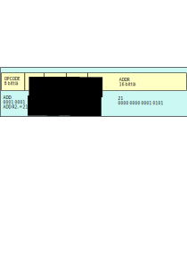

<lead>
Tässä osiossa esittellään kurssilla esimerkkitietokoneena käytettävän optuskäyttöön suunnitellun ttk-91 tietokoneen perusrakenne. Yleiskuva ttk-91 arkkitehtuurista annettiin Tietokoneen toiminnan perusteet MOOC'in luvussa 2. Jos nämä tiedot eivät ole ihan tuoreessa muistissa, ne kannattaisi kerrata nyt.
</lead>

## Ttk-91
Yleiskuva ttk-91 arkkitehtuurissa annettiin Tietokoneen toiminnan perusteet MOOC'in luvussa 2. Jos nämä tiedot eivät ole ihan tuoreessa muistissa, voit haluta kerrata ne nyt. Näitä tietoja kerrataan ja täsmennetään nyt tässä.

## Rekisterit
???

<!-- kuva: ch-5-1-a-ttk91-suoritin    -->

![Suoritin ja väylä tarkemmin. Väylä on jaettu kolmeen eri osaan, jotka ovat dataväylä, osoiteväylä ja kontrolliväylä. Suorittimen sisällä on neljä komponenttia, jotka ovat muistinhallintayksikkö MMU, rekisterit, aritmeettislooginen yksikkö ALU ja kontrolliyksikkö CU. Välimuisti puuttuu kuvasta kokonaan. Aritmeettisloogisessa yksikössä on esimerkin vuoksi mainittu ADD- ja MUL-suorituspiirit. Suorittimen komponentteja yhdistää niiden välinen omna sisäinen dataväylä ja niiden välisen kommunikoinnin toteuttavat kontrollisignaalit. Väylän lähellä on muistinhallintayksikkö MMU, jossa on sisäiset rajarekisterit Base ja Limit, muistin osoitusrekisteri MAR, muistin puskurirekisteri MBR ja väylän kontrollirekisteri BusCtl. Rekistereitä on kahdeksan kappaletta R0-R7. Kontrolliyksikkössä on neljä sisäistä rekisteriä. Ne ovat paikanlaskuri PC, käskyrekisteri IR, tilarekisteri SR ja tilapäisrekisteri TR.](./ch-5-1-a-ttk91-suoritin.svg)

<illustrations motive="ch-5-1-a-ttk91-suoritin"></illustrations>

## Konekäskyt
??

<illustrations motive="ch-5-1-b-ttk91-konekaskyn-rakenne"></illustrations>

### Muistiin viittaustavat
?????

### Muistitilan käyttö
???

<!-- kuva: ch-5-1-c-ttk91-muistitilan-kaytto   # kalvo 5.12  -->

![Kuva muistitilankäytöstä ohjelmalle P. Vasemmalla on iso korkea palkki, joka kuvaa koko muistia, ylhäällä olevasta osoitteesta 0 osoitteeseen iso, joka voi olla esimerkiksi 4 194 303. Keskellä isoa muistia on ohjelmalle P varattu alue, jonka alkuun osoittaa rekisteri BASE ja jonka koko on rekisterissä LIMIT. Oikealla on tämä sama P:n muistialue suurennettuna, ylhäällä olevasta osoitteesta 0 osoitteeseen LIMIT-1. Ylimpänä osoitteesta 0 alkaen on ohjelman koodialue, ja sitten heti sen perään muistialue globaaleille muuttujille ja muille tietorakenteille. Seuraavaksi on pino aliohjelmien toteuttamista varten. Kaikkein alimpana on keko, joka sisältää dynaamisesti suoritusaikana varattuja ja vapautettuja muistialueita. Keossa on siis sekaisin varattuja ja vapaana olevia muistialueita. Pinorekisteri osoittaa pinon loppuun ja kekorekisteri keon alkuun. Näiden rekistereiden väliin jäävä osa on vapaata muistitilaa, johon sekä pino että keko voivat kasvaa.](./ch-5-1-c-ttk91-muistitilan-kaytto.svg)

<illustrations motive="ch-5-1-c-ttk91-muistitilan-kaytto"></illustrations>

## Tiedon esitysmuodot
???

## Kääntäjän ohjauskäskyt
???

## Symbolinen konekieli vs. "puhdas" konekieli
???

<!-- key-terminology -->
<text-box variant="example" name="Tärkeitä termejä">

### termi1 ?????
selitys1 ???

</text-box>

## Quizit 5.1 ?????
<!-- quiz 5.1.1 Pitääkö  -->

<quiznator id="5caf0493fd9fd71425c6d6c6"></quiznator>

