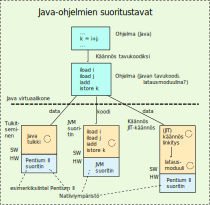
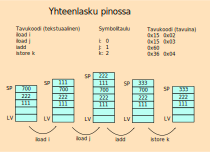
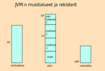
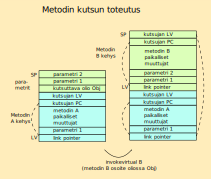
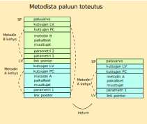

<div>
<lead>Tässä aliluvussa esittelemme pääpiirteet Java-ohjelmien suorittamisesta Java virtuaalikoneen (JVM) avulla. Käymme läpi JVM:n perusrakenteen ja sen konekielen (Javan tavukoodi, bytekode) käskytyypit. Seuraavassa aliluvussa käymme läpi tarkemmin erilaiset tavat toteuttaa Java-ohjelmien suoritus JVM:ssä. </lead>
</div>

[Java](https://fi.wikipedia.org/wiki/Java) on korkean tason olioperustainen ohjelmointikieli. Java-kieliset ohjelmat voisi kääntää ja linkittää ajomoduuleiksi samalla tavalla kuin edellisessä luvussa 9 esitettiin. Näin ei kuitenkaan yleensä tehdä. Korkean tason kielten kääntäjän toteutuksessa on usein osana välikieli, joka toimii siltana kääntäjän _front endin_ ja _back_endin_ välillä. Javassa tuo välikieli on nostettu näkyville erityisasemaan ja käännösmoduulit välitetään eteenpäin Javan välikieliesityksessä eikä Java-kielisinä käännösmoduuleina tai niiden objektimoduuleina.

Javan välikieli on nimeltään [bytecode](https://en.wikipedia.org/wiki/Java_bytecode) tai [Java bytecode](https://en.wikipedia.org/wiki/Java_bytecode). Käytämme siitä jatkossa nimiä tavukoodi tai Javan tavukoodi.

Javan tavukoodi on hypoteettisen Java virtuaalikoneen ([JVM](https://fi.wikipedia.org/wiki/Java), Java Virtual Machine) konekieltä, ihan samalla tavalla kuin ttk-91 konekieli on hypoteettisen ttk-91 suorittimen konekieltä. Toisin kuin ttk-91 ja sen konekieli, JVM ja sen tavukoodi ovat täydellisesti määriteltyjä.

## Java virtuaalikone (JVM)
Java virtuaalikone geneerinen suoritin, joka toimii rajapintana kaikille Java-ohjelmien erilaisille suoritusmuodoille. Kun useimmat todelliset suorittimet sisältävät rekistereitä laskutoimituksia varten, niin JVM:ssä kaikki laskentaa perustuu pinoon. Laskutoimitusten argumentit ovat aina pinon pinnalla ja aritmeettis-loogisssa operaatiossa ne korvautuvat laskutoimituksen tuloksella. Tyypillistä tällaisessa [pinokoneessa](https://en.wikipedia.org/wiki/Stack_machine) on, että aritmeettis-loogisissa operaatioissa ei tarvitse nimetä yhtään operandia, koska ne löytyvät oletusarvoisista paikoista pinon pinnalta. Operaation suorituksessa operandit otetaan pois pinosta ja tulos talletetaan pinoon. 

Rekisteripohjaiset suorittimet toimivat hyvin eri tavalla. Aritmeettis-loogisissa operaatioissa on yleensä nimetty kolme rekisteriä, joista yksi on tulosrekisteri. Tällä tavoin kummankaan operandin arvoa ei tarvitse tuhota. Ttk-91 suorittimessa aritmeettis-loogisissa operaatioissa oli vain kaksi nimettyä operandia, ja tulos talletetaan aina ensimmäisen operandin (rekisterin) päälle. 

JVM ei määrittele, onko suorituksessa rinnakkaisuutta vai ei. On täysin mahdollista, että yhdestä prosessista on samanaikaisesti suorituksessa useampi säie. Esimerkiksi kaksi peräkkäistä toisistaan riippumatonta metodin kutsua voisivat olla yhtä aikaa suorituksessa (moniytimisellä) laitteistolla, jos vain käytössä oleva JVM:n toteutus tämän sallii.

Javan virtuaalikone voidaan toteuttaa usealla eri tavalla, mikä tekee tästä mielenkiintoisen ohjelmien suoritusmallin. Suoritettava Java-ohjelma siis käännetään aina ensin tavukoodiksi, jonka jälkeen se suoritetaan _jollain tavalla toteutetulla_ JVM:llä. Periaatteessa meillä on ainakin neljä tapaa toteuttaa JVM ja Java-ohjelmia voi sitten suorittaa noilla kaikilla tavoilla. Esittelemme suoritustavat tässä lyhyesti ja seuraavassa aliluvussa tarkemmin. 

<!-- Kuva: ch-10-2-java-ohjelmien-suoritus -->


<div>
<illustrations motive="ch-10-2-java-ohjelmien-suoritus" frombottom="0" totalheight="40%"></illustrations>
</div>

Tulkitseminen tarkoittaa sitä, että meillä on _JVM tulkki_ (tulkki, Java tulkki), jossa on kaikki JVM:n rakenteet toteutettu tulkin (ohjelman) tietorakenteina. Java-tulkki lukee datana tavukoodin käskyjä yksi kerrallaan ja sitten toteuttaa käskyjen aiheuttamat muutokset JVM:n tietorakenteissa. Esimerkiksi iadd-käsky poistaa pinon pinnnalta kaksi kokonaislukua ja tallettaa pinon pinnalle niiden summan. Suoritustapa on hyvin samanlainen kuin miten Titokone lukee ttk-91 konekäskyjä ja emuloi niiden aiheuttamia muutoksia simuloiduissa ttk-91 rekistereissa ja muistissa. Java tulkki on normaali korkean tason kielellä toteutettu ohjelma, joka on käännetty ja linkitetty käytössä olevaan järjestelmään. Järjestelmä voi käyttää mitä tahansa suoritinta, esimerkiksi Intelin Pentium II:sta.

JVM:n voi toteuttaa myös suoraan laitteistolla _JVM suorittimella_ (Java suorittimella), joka suorittaa tavukoodia konekäskyinä. Tämä vastaa tilannetta, jossa (täydellisesti määritelty) ttk-91 toteutettaisiin oikeasti todellisena suorittimena. Tässä tapauksessa latausmoduuli siis sisältää alkuperäisen Java-ohjelman tavukoodisen esityksen ja prosessin suoritusaikana tavukoodi luetaan koodina eikä datana. 

Kolmas vaihtoehto on _kääntää ja linkittää_ ohjelman tavukoodinen esitysmuoto "normaalitapaan" järjestelmän suorittimen konekielelle. Tämä vaihtoehto muistuttaa eniten edellisessä luvussa kuvattua menettelyä, mutta sitä ei yleensä käytetä. Menetelmä eroaa normaalista kääntämisestä siinä, että käännösmoduulit ovat tavukoodia eivätkä korkean tason kielen koodia.

Neljäs vaihtoehto perustuu _Just-In-Time käännökseen_, jossa kukin viitattu Javan moduuli käännetään ja linkitetään paikalleen vasta tarvittaessa. Tämä on vähän samanlaista kuin dynaamisessa linkityksessä, mutta objektimoduulien asemesta uuden moduulin esitysmuotona on tavukoodi. Lähestymistapa on joustavaa, koska tavukoodi on geneeristä, mutta objektimoduulien koodi on aina jollain tietyllä konekielellä. Dynaamisen linkittäjän lisäksi tarvitaan nyt myös tavukoodin kääntäjä natiiviympäristön suorittimelle.

### JVM:n pino

Java virtuaalikoneessa on _pino_, jossa on ohjelman tietorakenteet, välitulokset ja aktivaatiotietueita vastaavat _kehykset_. Pinossa on siis mm. kaikki ohjelman käyttämät muuttujat ja laskennan välitulokset. Tämä on hyvin erilainen lähestymistapa kuin todellisissa suorittimissa yleinen tapa säilyttää usein tarvittavien muuttujien arvoja ja laskennan välituloksia nopeissa rekistereissä. Jos JVM toteutetaan rekisterikoneessa, niin toteutusta voi hidastaa se, että kaikki data on (ainakin teoriassa) muistissa olevassa JVM:n pinossa.

Pinolle on normaalien "push/pop"-käskyjen lisäksi JVM:ssä on myös _kehyksille_ (JVM:n "aktivaatiotietueille") omat "push/pop"-käskynsä, jolloin niitä ei tarvitse rakentaa ja purkaa sana kerrallaan. Tarkennamme kehysten käyttöä ihan kohta.

JVM:n pinon ei tarvitse olla yhtenäisellä muistialueella, vaan se allokoidaan _keosta_ (kuten kaikki muutkin JVM:n tietorakenteet). Pinon koko voi olla rajallinen tai dynaamisesti laajennettavissa, jolloin pinon muistitilan loppuessa sille voidaan varata lisää muistitilaa keosta. Sama pätee kaikkiin muihinkin JVM:n varaamiin tietorakenteisiin. 

Pinoon osoittaa kaksi rekisteriä. SP (stack pointer) osoittaa pinon päällimmäiseen alkioon ja LV (local variables frame) nykykehyksen alkuun ja samalla sen ensimmäiseen paikalliseen muuttujaan. Kumpaankaan näistä rekistereistä (kuten ei muihinkaan JVM:n rekistereistä) ei mitenkään nimetä JVM:n konekäskyissä, vaan kaikki rekisteriviittaukset ovat implisiittisiä. Esimerkiksi add-käsky viittaa dataan aina SP:n kautta, vaikka SP:tä ei mitenkään nimetä konekäskyssä.

Allaolevan esimerkin lähtötilanteessa olemme suorittamassa jotain Javan metodia (aliohjelmaa), jossa on kolme kokonaislukuarvoista paikallista muuttujaa. Paikallisen muuttujan i arvo on 111, j:n arvo on 222 ja k:n arvo on 700. Ne ovat pinossa tämän kutsukerran kehyksessä, jonka alkuun osoittaa LV. Rekisteri SP osoittaa pinon huipulle. Tavukoodissa seuraavana olevilla käskyillä lasketaan Javan lause "k=i+j;". Suoritusaikana tavukoodi on (tietenkin) vain numeerisia tavuja, mutta esimerkin vuoksi esitämme sen tässä (myös) tekstuaalisessa muodossa. Koodinpätkän seitsemän tavun heksadesimaaliesityksen ja tekstuaalisen tavukoodin välillä on suoraviivainen vastaavuus.

```
Tavukoodi tekstuaalisena    tavuina        
          iload i           0x15 0x02      i:n osoite on LV+2
          iload j           0x15 0x03      j:n osoite on LV+3
          iadd              0x60
          istore k          0x36 0x04      k:n osoite on LV+4
```

<!-- Kuva: ch-10-2-yhteenlasku-pinossa -->


<div>
<illustrations motive="ch-10-2-yhteenlasku-pinossa" frombottom="0" totalheight="40%"></illustrations>
</div>

Pinokoneiden heikkoutena on, että jokainen aritmeettinen operaatio tuhoaa molemmat operandinsa. Argumenttien arvot täytyy aina kopioida pinon huipulle ennen aritmeettis-loogisia operaatioita ja niiden tulokset täytyy vastaavasti ottaa talteen operaation jälkeen. Lisäksi tarvitaan erilaisia replikointikäskyjä, joilla monistetaan pinon pinnalla olevia arvoja. 

Paikallisiin muuttujiin ja muihin tietorakenteisiin viitataan käyttäen niiden suhteellisia osoitteita LV:n suhteen. Tilanne on täysin vastaava kuin ttk-91:ssä aliohjelmien paikallisiin muuttujiin viittaaminen kehyksen osoitteen (FP) suhteen.

Ensimmäinen käsky _iload i_ kopioi paikallisen muuttujan i arvon 111 pinon huipulle ja toinen käsky _iload j_ kopioi vastaavasti paikallisen muuttujan j arvon 222 pinon huipulle. Yhteenlaskukäsky _iadd_ ottaa argumentit pois pinosta, laskee niiden summan 333 ja tallettaa sen pinon huipulle. Lopulta pinoon talletuskäsky _istore k_ ottaa tuloksen pois pinosta ja tallettaa sen k:n arvoksi. 

Koska iload-käskyn parametrin arvo on useimmiten 0, 1, 2 tai 3, niin niitä varten [tavukoodin käskyissä](https://en.wikipedia.org/wiki/Java_bytecode_instruction_listings) on myös omat yhden tavun konekäskynsä *iload_0*,  *iload_1*, *iload_2* ja  *iload_3*. Käskyllä istore on vastaavat optiot, mutta siinäkin vain parametriarvoihin 0-3. Näitä käskyjä käyttäen em. koodinpätkän saisi tavukoodina mahtumaan vain 5 tavuun.


```
Tavukoodi tekstuaalisena    tavuina        
          iload i           0x1c           i:n osoite on LV+2
          iload j           0x1d           j:n osoite on LV+3
          iadd              0x60
          istore k          0x36 0x04      k:n osoite on LV+4
```

Tämä näyttää vähän tehottomalta, kun operandeja pitää kopioida pinon pinnalle laskutoimituksia varten, molemmat operandit tuhoutuvat aritmetiikkaoperaatioissa ja kaikki dataviitteet kohdistuvat muistissa olevaan pinoon. Rekisteripohjaisissa suorittimissa JVM:n emulointi onkin vaikeaa, kun suoritinarkkitehtuurien peruslähtökohdat ovat niin erilaisia pinokoneella ja rekisterikoneella. 

### JVM:n keko, metodialue ja vakioallas
JVM:ssä kaikki muistinhallinta on keskitetty JVM:n omaan kekoon. Aina kun ohjelma tarvitsee lisää muistitilaa (esim. uudelle Javan olion instassille Java-operaatiolla _new_), niin JVM:n toteutusympäristö varaa sen tästä keosta. Vastaavasti, jos JVM itse tarvitsee lisää muistitilaa (esim. pinoa varten), niin myös se varataan täältä. 

JVM:ssä ei ole mitään varatun tilan vapauttamiskäskyä, vaan tila vapautuu uusiokäyttöön _automaattisen roskienkeruun_ kautta. Se tarkoittaa, että aika ajoin (a) laskenta pysähtyy, (b) roskienkeruu käynnistyy ja vapauttaa aikaisemmin varatun mutta ei enää käytössä olevan muistitilan ja (c) lopulta laskenta voi jatkua. Roskienkeruussa ensin merkitään kaikki muistialueet vapaiksi. Sitten käydään läpi kaikki ohjelman ja JVM:n sillä hetkellä käytössä olevat muistialueet merkiten ne samalla varatuiksi. Lopuksi otetaan uusiokäyttöön jäljelle jääneet vapaaksi merkityt alueet. Ymmärrettävästi tämä voi viedä aikaa. Roskienkeruu on ongelmallista, koska se pysäyttää laskennan satunnaisiin aikoihin ja voi kestää pitkäänkin. 

Pinossa on jokaiselle metodin kutsulle sitä vastaava kehys, jonka päällä voi vielä olla siinä metodissa vielä käytössä olevat välitulokset. Pinoa käytetään siis sekä metodin kutsurakenteen toteutukseen että laskennan välitulosten tallentamiseen. 

<!-- Kuva: ch-10-2-muistialueet -->


<div>
<illustrations motive="ch-10-2-muistialueet" frombottom="0" totalheight="40%"></illustrations>
</div>

JVM:ssä on SP:n ja LV:n lisäksi vain kaksi muuta rekisteriä. Rekisteri PC on tavanomainen paikanlaskuri ja osoittaa seuraavaksi suoritettavaan (tavukoodiseen) käskyyn nykyisessä metodissa. Metodien koodit on talletettu omalle metodialueelleen (JVM Method Area), joka on yhteiden kaikille yhden prosessin säikeille. 

Rekisteri CPP (Constant Pool Pointer) osoittaa _vakioaltaaseen_ (constant pool), jossa on kaikki ohjelman käyttämät vakiot ja muut symboliset viitteet. Vakioaltaan tietoihin viitataan käyttäen niiden suhteellista osoitetta CPP:n suhteen. Jokaiselle Javan luokalle (class) ja liittymälle (interface) on oma vakioaltaansa, joka on suoritusaikainen esitystapa tiedoston _class constant pool_ taulukolle. Tämä vastaa vähän symbolitaulua (tai sen osaa). Vakioaltaassa on useita eri tyyppisiä vakioita, kuten esimerkiksi tavalliset literaalit ja suoritusaikana ratkottavat attribuutit dynaamista linkitystä (JIT) varten. Vakioaltaat varataan tietenkin keosta.

Jos suoritettavia säikeitä on useita, niin kaikilla on omat rekisterinsä, pinonsa ja vakioaltaansa. Niillä on kuitenkin yhteinen metodialue ja keko.

### Metodin kutsu
Metodin kutsukäsky on _invokevirtual_ ja se luo uuden kehyksen pinoon. Ennen käskyä _invokevirtual_ kutsuja laittaa pinoon viitteen kutsuttavan _olion_ luokkaan ja parametrien arvot. Käskyssä _invokevirtual_ annetaan parametrina viite kutsuttavaan metodiin ja käskyn _invokevirtual_ suorituksen jälkeen uusi kehys on valmis. 

Ajatellan esimerkin vuoksi metodia A, jossa on paikalliset muuttujat x ja y. Metodissa A on seuraavana Java-lausetta "y=Obj.B(x, 5)" vastaava tavukoodinen kutsu. Kutsu voisi toteuttaa vaikkapa seuraavalla tavalla.

```
Metodi A

...
getstatic #35       0xb2 0x00 0x23   viite olion Obj luokkaan on CPP+35:ssä
iload  x            0x1b             parametri 1, muuttujan x arvo, osoite LV+1
bipush 5            0x10 0x05        parametri 2, vakio 5
invokevirtual #37   0xb6 0x00 0x25   viite metodiin B on CPP+37:ssä
```

<!-- Kuva: ch-10-2-metodin-kutsu -->


<div>
<illustrations motive="ch-10-2-metodin-kutsu" frombottom="0" totalheight="40%"></illustrations>
</div>

Esimerkissä käskyn _invokevirtual_ jälkeen kutsutun metodin B kehys on valmis. Paluusoite löytyy epäsuorasti osoitteesta LV, parametrit ovat osoitteissa LV+1 ja LV+2, minkä jälkeen pinossa on paikalliset muuttujat. Pinon pinnalla on aikaisemman metodin A kehyksen osoite, mitä tarvitaan metodista B paluun yhteydessä.

Oletetaan nyt, että metodi B palauttaa arvonaan yhden kokonaisluvun, joka on ennen metodista paluukäskyä _ireturn_ talletettu pinon pinnalle. 

```
metodi Obj.B

...
iload  g          0x15  0x08  aseta paluuarvo paikallisesta muuttujasta g, osoite LV+8
ireturn           0xac        palauta paluuarvo ja kontrolli kutsuvaan rutiiniin
```

<!-- Kuva: ch-10-2-metodista-paluu -->


<div>
<illustrations motive="ch-10-2-metodista-paluu" frombottom="0" totalheight="40%"></illustrations>
</div>

Käskyn _ireturn_ suorituksessa metodin B kehyksen tiedoilla palautetaan rekistereiden PC, LV ja SP arvot ennalleen ja kopioidaan paluuarvo pinon huipulle. Metodin A suoritus voi nyt jatkua ja ensimmäisenä se tietenkin ottaa paluuarvon talteen.  Metodin B käyttö on nyt kokonaisuudessaan seuraavanlainen.

```
metodi A

...
getstatic #35       0xb2 0x00 0x23   viite olion Obj luokkaan on CPP+35:ssä
iload  x            0x1b             parametri 1, muuttujan x arvo, osoite LV+1
bipush 5            0x10 0x05        parametri 2, vakio 5
invokevirtual #37   0xb6 0x00 0x25   viite metodiin B on CPP+37:ssä
istore y            0x36 0x04        paluuarvo pinosta muuttujaan y, osoite LV+4
```
## Tavukoodi
Tarkoituksemme ei ole käydä kaikkia [tavukoodin käskyjä](https://en.wikipedia.org/wiki/Java_bytecode_instruction_listings) läpi, vaan antaa yleiskuva niistä. Käymme kursorisesti läpi tavukoodin tietotyypit, tiedonosoitusmoodit ja erilaiset käskytyypit.

### Tietotyypit
Käytössä on 1-, 2-, 4- ja 8-tavuiset kokonaisluvut. Datatyyppien nimet ovat vastaavasti _byte_, _short_, _int_ ja _long_. Negatiiviset luvut esitetään kahden komplementin esitysmuodossa. Pieni 1-2 tavun data pakataan taulukoihin ja niihin viitataan taulukoissa omilla load- ja store-konekäskyillä. Pinossa ja vakioaltaassa kaikki data on kokonaisina sanoina. 

Liukuluvut esitetään [IEEE liukulukustandardin](https://en.wikipedia.org/wiki/IEEE_floating_point) mukaisesti. Tavallinen liukuluku _float_ on 4 tavua (32 bittiä) ja kaksoistarkkuuden liukuluku _double_ on 8 tavua (64 bittiä).

Merkit esitetään käyttäen etumerkitöntä [Unicode](https://en.wikipedia.org/wiki/Unicode) merkistöä, jossa kukin merkki esitetään kahdella tavulla. Merkkijonot talletetaan vakioaltaaseen. Emme käsittele JVM:n merkkejä tai merkkijonoja tämän enempää.

### Tiedonosoitusmoodi
Tavukoodissa tiedonosoitus on välitöntä tai indeksoitua. Indeksoidut viitteet ovat suhteessa SP-, LV- tai CPP-rekistereihin, mutta rekisteri määräytyy implisiittisesti konekäskyyn mukaan. 

```
iadd               0x60             implisiittiset dataviittaukset pinoon, osoitteet SP, SP-1
bipush 5           0x10 0x05        viite vakioarvoon 5 (välitön operandi)
iconst_1           0x04             implisiittinen viite kokonaislukuvakioon 1
fconst_1           0x0c             implisiittinen viite liukulukuvakioon 1.0
iload 6            0x15 0x06        viite dataan osoitteessa LV+6 (indeksoitu viite)
invokevirtual #37  0xb6 0x00 0x25   viite dataan osoitteessa CPP+37 (indeksoitu viite)
```

Koodiin voi tehdä myös indeksoituja viitteitä suhteessa PC-rekisterin arvoon. Koodiviitteet ovat _tavuosoitteita_, koska käskyjen pituudet voivat 1-17 tavua (yleensä 1-3 tavua). 

```
invokevirtual #37   0xb6 0x00 0x25   PC saa CPP+37:ssä olevan arvon (metodin osoitteen luokassa)
goto -27            0xa7 0x80 0x1B   PC saa arvon PC-27, ehdoton hyppy taaksepäin, 
                                     siirtymän määrä 16-bittisenä etumerkillisenä kokonaislukuna
```

### Käskytyypit
Käytössä on useita tietotyyppejä ja kussakin aritmeettis-loogisessa operaatiossa argumenttien täytyy olla saman kokoisia ja samaa tyyppiä. Tätä varten käskykannassa on useita datan tyypinmuunnoskäskyjä. 

```
i2b       0x91       muuta 32-bittinen kokonaisluku (word) 8-bittiseksi (byte). Etumerkki!
i2f       0x86       muuta 32-bittinen kokonaisluku (word) 32-bittiseksi liukuluvuksi (float)
d2l       0x8f       muuta 64-bittinen liukuluku (double) 64-bittiseksi kokonaisluvuksi (long)
d2i       0x8e       muuta 64-bittinen liukuluku (double) 32-bittiseksi kokonaisluvuksi (int)
```

Tiedonsiirtokäskyistä on jo esitelty käskyjä, joilla kopioidaan 32-bittinen kokonaisluku pinon pinnalle tai siirretään pinon pinnalla olevaa dataa muualle. Vastaavat käskyjä on eri pituisille data-alkioille ja tietotyypeille. Aritmeetis-loogisten lausekkeiden toteutuksissa tarvitaan usein monistaa pinon pinnalla olevaa dataa tai järjestää sitä uuteen järjestykseen.

``` 
iload_2        0x1c            push (LV+2)     tuo kokonaisluku
istore 17      0x36 0x11       pop  (LV+17)    vie kokonaisluku
lload  12      0x16 0x0C       push (LV+12)    tuo pitkä kokonaisluku
fload  10      0x17 0x0A       push (LV+10)    tuo liukuluku
dstore 6       0x39 0x06       pop  (LV+6)     vie pitkä liukuluku
aload_3        0x2d            push (LV+3)     tuo osoite
dup            0x59            push (SP)       monista data
dup_x2         0x5b            push (SP-2)     monista data
dup2           0x5c            push (SP)       monista pitkä data 
swap           0x5f            swap(SP, SP-1)  vaihda sanat
iconst_1       0x04            push 1          tuo kokonaislukuvakio
fconst_1       0x0c            push 1.0        tuo liukulukuvakio
getstatic #35  0xb2 0x00 0x23  push (CPP+35)   tuo luokan viite 
```

Taulukkoviitteet ovat JVM:ssä yllättävän vaikeita. Ensin pitää pinon pinnalle saada taulukon alkuosoite ja indeksi, minkä jälkeen vasta voidaan tehdä varsinainen taulukkoviite. Esimerkiksi, Java-lauseen "a=t[i];" toteutus tavukoodilla voisi olla 

```
aload_1         0x2b          push (LV+1)   taulukon alkuosoite t
iload_2         0x1c          push (LV+2)   indeksi i
iaload          0x2e          push (t[i])   korvaa t ja i alkion t[i] arvolla
istore_3        0x3e          pop (LV+3)    taulukon kokonaislukuarvo
```

Jos taulukko t sisältäisi 1 sanan kokonaislukujen asemesta yhden tavun kokonaislukuja, niin saman lauseen toteutus olisi 

```
aload_1         0x2b          push (LV+1)   taulukon alkuosoite t
iload_2         0x1c          push (LV+2)   indeksi i
baload          0x33          push (t[i])   laajennna tavu samalla sanaksi
istore_3        0x3e          pop (LV+3)    tallenna kokonaislukuarvo sanana
```


Kontrollinsiirtokäskyjä on paljon, koska eri tietotyypeille tarvitaan kullekin omat ehdolliset haarautumiskäskynsä. 

```
goto -27            0xa7 0x80 0x17   PC saa arvon PC-27, ehdoton hyppy taaksepäin
if_icmpgt  +33      0xa3 0x00 0x21   vertaa pinon arvoja. Jos isompi, niin PC saa arvo PC+33
if_icmpeq  -27      0x9f 0x80 0x1B   vertaa pinosn arvoja. Jos sama, niin PC saa arvo PC-27
iflt  +33           0x9b 0x00 0x21   jos pinossa oleva arvo <0, niin PC saa arvon PC+33
lcmp                0x94             vertaa kahta pitkää kokonaislukua, tulos pinoon (+1, 0, -1)
fcmpg               0x96             vertaa kahta liukulukua, tulos pinoon (+1, 0, -1)
invokevirtual #37   0xb6 0x00 0x25   call (CPP+37)
ireturn             0xac             palaa kutsutusta metodista
```

Aritmeettis-loogisia operaatioita on vastaavasti useita, koska niitä tarvitaan eri pituisille ja eri tietotyypeille. 

```
iadd      0x60     kokonaislukujen (int) yhteenlasku
iand      0x7e     and-operaatio pareittain 32-bittisille loogisille arvoille kokonaisluvuissa
dmul      0x63     64-bittisten liukulukujen yhteenlasku
ldiv      0x6d     64-bittisten kokonaislukujen jakolasku
lrem      0x71     64-bittisten kokonaislukujen jakolaskun jakojäännös
```

Lisäksi tavukoodiin sisältyy sekalainen joukko muita käskyjä, joista alla on muutamia esimerkkejä.

```
nop          0x00             no operation, kuluttaa vähän aikaa
pop          0x57             ota sana pinosta, heitä pois
arraylength  0xbe             pinon päällä viitatun taulukon pituus
athrow       0xbf             aiheuta keskeytys
new  House   0xbb  0x00 0x03  luo uusi House-tyyppinen olio (instanssi)  
```

## Esimerkki tavukoodin käytöstä
Meillä on Java-kielinen koodinpätkä

```
k = i+5;

if (k=10)
    j=i;
else 
    j=k;
``` 

Kokonaislukuarvoiset muuttujat i, j ja k ovat paikallisia muuttujia kehyksen osoitteissa 7, 8 ja 9. Jos tavukoodinen koodinpätkä alkaa tavusta 100 (desimaaliluku), niin tästä voisi generoitua tavukoodi

```
tavukoodi tekstinä       heksadesimaalina

strt  iload i            100:   0x15 0x07
      bipush 5           102:   0x10 0x05
      iadd               104:   0x60   
      dup                105:   0x59             k tarvitaan kohta taas
      istore k           106:   0x36 0x09     
      
      bipush 10          108:   0x10 0x0A        k oli pinossa jo
      if_icmpeq else     110:   0x0f 0x00 0x0A   110+10=120
if10  iload i            113:   0x15 0x07
      istore j           115:   0x36 0x08
      goto done          117:   0xa7 0x00 0x07   117+7=124
else  iload k            120:   0x15 0x09
      istore j           122:   0x36 0x08
done  nop                124:   0x00
```

Tavun 105 käsky _dup_ käyttö vaati jo vähän optimointia. Lisäoptimoinnilla tämäkin koodi voisi ehkä olla vielä tehokkaampi. Esimerkiksi _istore j_ käskyt voisi yhdistää haarautumisen jälkeen tehtäväksi. 

## Quizit 9.2
<!-- Quiz 9.2.?? -->

<div><quiz id="4b44871b-2fe7-4fe1-978c-267d5bf8de80"></quiz></div>
