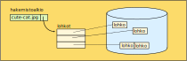

<lead>Tässä????</lead>

## Tiedostojärjestelmä ja tiedostot
Tieto massamuistissa on yleensä organisoitu erillisiksi tiedostoiksi. Esimerkiksi, tiedosto program.exe sisältää windows-käyttöjärjestelmän tunnistaman ladattavan ohjelman ja cute-cat.jpg sisältää käyttäjän tallettaman soman kissakuvan. Käyttöjärjestelmä pitää kirjaa kaikista tiedostoista ja niiden sijainneista massamuistissa. Se valvoo tiedon pääsyoikeuksia, jotta Pekka ei vahingossa pääse katsomaan Maijan kissakuvia, tai että kukaan tavallinen käyttäjä ei pääse ohjelmakoodeja ilman lupaa.

Tiedostolla voi olla oma sisäinen rakenteensa, jolloin se koostuu useasta erillisestä [tietueesta](https://fi.wikipedia.org/wiki/Tietue). Esimerkiksi lennonvarausjärjestelmässä yksi tietue voi sisältää yhden asiakkaan tietyn varatun lennon tiedot. Emme käsittele tällaisia tiedostojärjestelmiä tässä tämän enempää.

Yleensä tiedosto koostuu useasta tavusta, jotka esittävät merkkipohjaista tietoa tai jotain rakenteista tietoa kuten kuvaa tai ääninäytettä.  Tiedostoa voidaan käsitellä koknaisuutena (esim. kuva) tai tavu kerrallaan (esim. tekstinkäsittelyssä tekstitiedosto). 

Käyttöjärjestelmä muuntaa tekstimuotoiset tiedostonimet hakemistopolkuineen (esim. "/usr/home/kerola/pictures/cats/cute-cat.jpg") tiedostojärjestelmän sisäiseksi osoitteeksi (esim. linux inode 234), mikä tekee tiedostojen käyttämisestä hyvin helppoa. Tiedostojärjestelmä sitten tarkentaa sisäisen osoitteen suoritusaikana tiettyyn kovalevyyn ja täsmälliseen sijaintiin siellä. On hyvin kätevää, kun ohjelmaa kirjoittaessa ei tarvitse ottaa kantaa siihen, minkä tyyppisellä laitteella tai missä jokin tiedosto sijaitsee. 

Aina kun tiedostoa avataan käyttöä varten, järjestelmä tarkistaa, mitä oikeuksia tiedoston omistaja on antanut tiedoston avaamista haluavalle ohjelmalle. Ohjelman oikeudet taas määräytyvät sen mukaan, kuka käyttäjä on ohjelman käynnistänyt. Jos Maija ei ole antanut tiedostonsa cute-cat.jpg lukuoikeutta muille, niin tavallisen käyttäjän Pekan käynnistämä ohjelma ei pysty avaamaan tiedostoa cute-cat.jpg ja Pekkaa harmittaa. Toisaalta, jos Pekka on järjestelmän ylläpitäjä, niin hän voi joka tapauksessa lukea tiedostoa cute-cat.jpg ja se taas voi harmittaa Maijaa!

Jos tiedostoa lukea vähän kerrallaan, niin tiedostojärjestelmä pitää kirjaa siitä, missä kohtaa kukin prosessi on kutakin tiedostoa lukemassa. Vaikka prosessi lukisi tiedostoa yksi merkki kerrallaan, niin tiedostojärjestelmä lukee niitä isompi lohko kerrallaan ja lohkon koko sopii hyvin yhteen massamuistilaitteen teknologian kanssa. Esimerkiksi, levymuistista voisi lukea 4 KB lohkoja käyttöjärjestelmän ylläpitämään puskuriin, josta käyttäjäprosessi saa tietoja käyttöönsä tavu kerrallaan halutessaan. 

Tiedoston lohkot on talletettu kovalevylle siellä oleviin vapaisiin paikkoihin ja tiedostojärjestelmä pitää kirjaa lohkojen sijainnista kovalevyllä. Tiedoston nimen perusteella sen hakemistosta löytyy sille hakemistoalkio, jossa on esim. linkki sen tiedoston lohkolistaan. Lohkolistassa on tiedot jokaisen tämän tiedoston levylohkon sijainnista.

<!-- Kuva: ch-8-2-tiedoston-lohkot -->

<illustrations motive="ch-8-2-tiedoston-lohkot" frombottom="0" totalheight="40%"></illustrations>

Tiedostojärjestelmän tarkempi toiminta esitellään yliopiston käyttöjärjestelmäkurssilla.

## Kovalevyn (kiintolevyn) toteutus

### SSD ja NVMe
????

## Levypalvelimet
????

## Pilvipalvelimet

???

## Quizit 9.2
<!-- Quiz 9.2.?? -->

<quiz id="4b44871b-2fe7-4fe1-978c-267d5bf8de80"></quiz>

