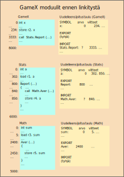

<lead>Tässä aliluvussa annamme yleiskuvan linkityksen toteuttamisesta. Staattisesti ennen suoritusta 
</lead>

## Staattinen linkitys
Normaalitapaus linkityksestä on staattinen linkitys, jossa ohjelman kaikki objektimoduulit yhdistetään yhdeksi ajomoduuliksi ennen suoritusta. Kaikilla tunnuksilla on tunnettu arvo, eikä mitään ohjelman osia puutu.

Tämän pääluvun alussa ensimmäsessä aliluvussa esiteltiin linkityksen perusidea. Täsmennämme nyt sitä tässä esimerkin avulla.

Meillä on kolme käännettyä moduulia, jotka ovat Main, Stats ja Math. Math-moduuli voi olla kirjastomoduuli, mutta sillä ei ole tässä merkitystä. Pääohjelma on moduulissa Main, jonka osoiteavaruus on 0-7999. Siellä on määritelty ainakin yksi muuttuja X (osoitteessa 0), johon viitataan ainakin osoitteessa 234 olevassa konekäskyssä. Konekäskyssä osoitteessa 3333 kutsutaan moduulin Stats tilastorutiinia Report. Main'in uudelleensijoitustaulusta löytyy paikallisen symbolin X arvo 0 ja sen viittauskohdat.  Main'in EXPORT-hakemisto on tyhjä, koska siinä moduulissa ei ole muiden moduulien viitattavissa olevia rakenteita. Sen IMPORT-hakemistossa on tilastorutiini Stats.Report, johon on viitattu käskyssä 3333.

Moduulin Stats osoiteavaruus on 0-5999. Siellä on (ainakin) yksi muuttuja A, joka on osoitteessa 0 ja johon on viitattu osoitteissa 302 ja 850. EXPORT-hakemistossa on (ainakin) moduulin palvelurutiini Report, jonka osoite on 800. IMPORT-hakemistossa on (ainakin) matematiikkarutiini Math.Aver, johon on viitattu osoitteessa 840.

Moduulin Math osoiteavaruus on 0-4999. Siellä on (ainakin) yksi muuttuja Sum, joka on osoitteessa 0 ja johon on viitattu osoitteessa 5. EXPORT-hakemistossa on (ainakin) keskiarvon laskentarutiini Aver, jonka osoite on 2400. Sen IMPORT-hakemisto on tyhjä, koska moduuli Math ei käytä mitään moduulin ulkopuolisia rakenteita.

<!-- kuva: ch-9-3-moduulit-ennen-linkitysta  -->

<illustrations motive="ch-9-3-moduulit-ennen-linkitysta"></illustrations>

Linkityksessä moduulit täytyy laittaa muistiin johonkin järjestykseen ja samalla niiden osoiteavaruudet täytyy yhdistää. Tääl kertaa laitamme ne edellä esitetyssä järjestyksessä, jolloin Main tulee ensimmäisenä ja Math viimeisenä. Koska Main on ensimmäisenä, niin sen osoitteet eivät muutu ja sen uudelleensijoitusvakio on nolla (0). 

Seuraavaksi tulee moduuli Stats. Sitä edeltää moduuli Main, jonka koko on 8000 sanaa, joten uudelleensijoitusvakio on 8000. Moduulin kaikkiin sisäisiin viitteisiin täytyy lisätä tuo 8000, joten kaikki muuttujan a viittaukset täytyy päivittää osoitteeseen 8000. Palvelurutiinin Report osoite oli 800, mutta nyt se päivittyy osoitteeksi 8800.  

Kirjastomoduuli Math on viimeisenä. Sitä edeltävät moduulit Main ja Stats, joiden yhteinen koko 14000 on siten moduulin Math uudelleensijoitusvakio.  kaikki viitteet muuttujaan Sum kohdistuvatkin nyt osoitteeseen 14000 ja keskiarvonlaskentarutiinin Aver osoite pitää päivittää lisäämällä siihen 14000.

<!-- kuva: ch-9-3-moduulit-jälkeen-linkityksen  -->

<illustrations motive="ch-9-3-moduulit-jälkeen-linkityksen"></illustrations>

Linkitetyn moduulissa kaikilla symboleilla on arvo. Sen EXPORT-hakemistossa on uuden linkitetyn moduulin osoitteet kaikille palvelurutiineille ja IMPORT-hakemisto on tyhjä, koska kaikki viitteet muihin moduuleihin on ratkaistu. 

Symbolien viittauskohdat on päivitetty linkitetyn moduulin uudelleensijoitustauluun siltä varalta, että linkitys vielä jostain syystä jatkuisi eteenpäin. 

## Quizit 9.3 staattinen linkitys
<!--  quizit 9.3.???  -->

<quiz id="aec1b502-8b29-4f47-a0a8-e702f13cbda7"></quiz>

## Dynaaminen linkitys
Useissa tapauksissa voi olla järkevää tehdä linkitys dynaamisesti vasta suoritusaikana. Oletetaan esimerkiksi, että edellisen esimerkin kirjastomoduuli Math on dynaamisesti linkitettävä moduuli.  

### Windowsin kaksi eri dynaamista linkitystä
????

## Quizit 9.3 ????
<!--  quizit 9.3.???  -->

<quiz id="4b44871b-2fe7-4fe1-978c-267d5bf8de80"></quiz>

